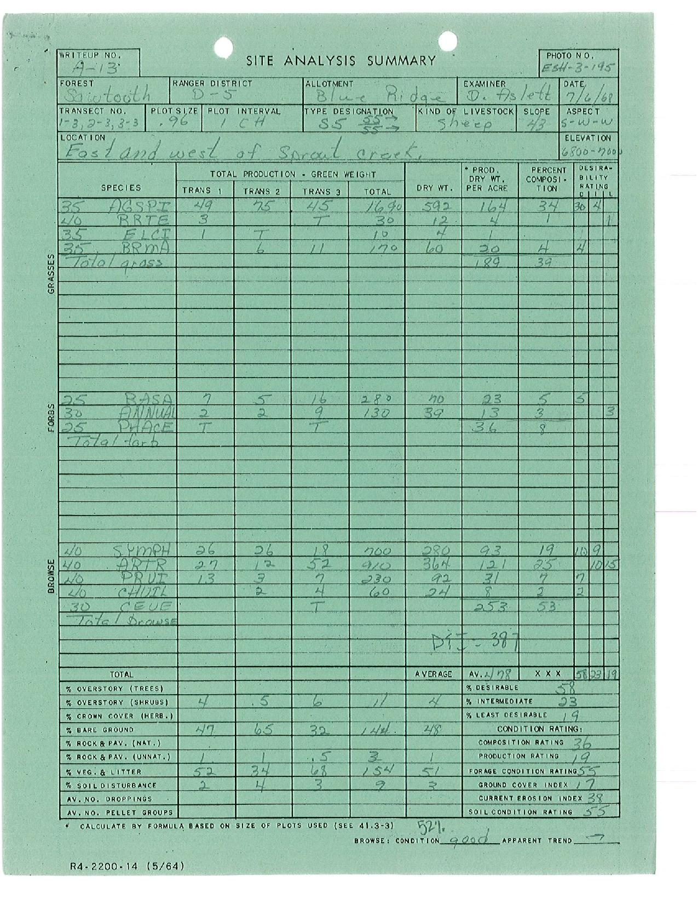
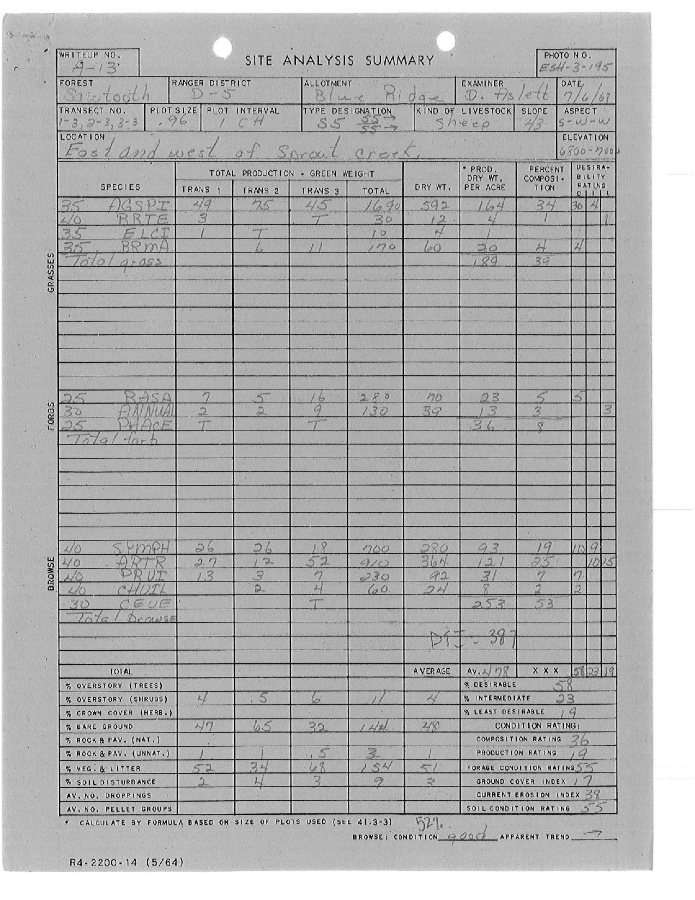
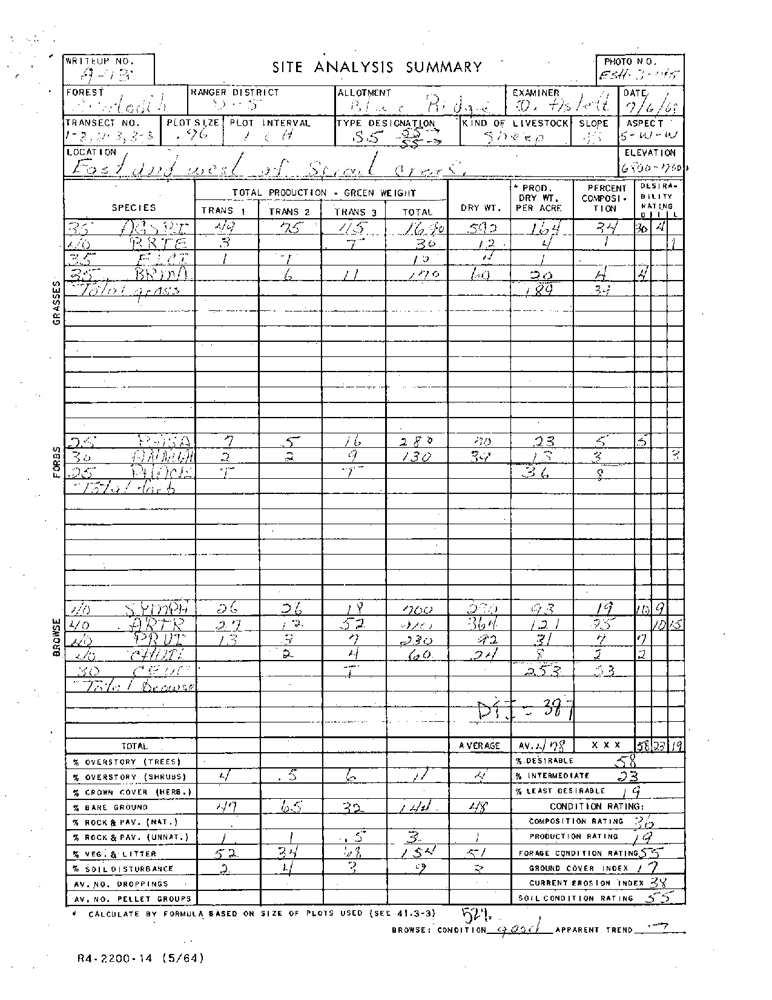
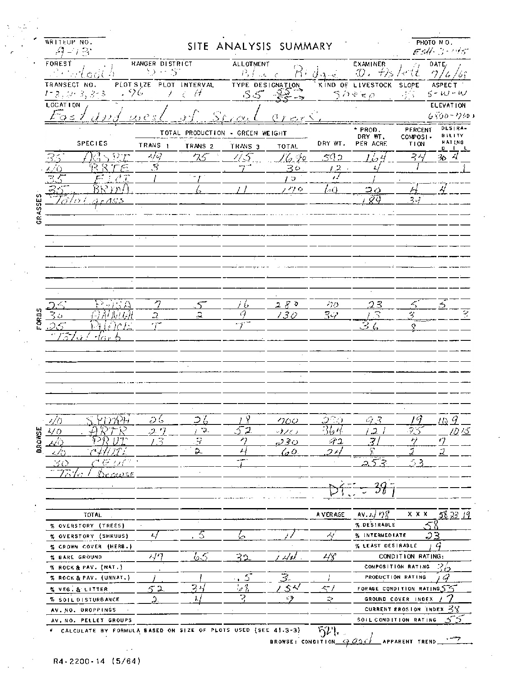
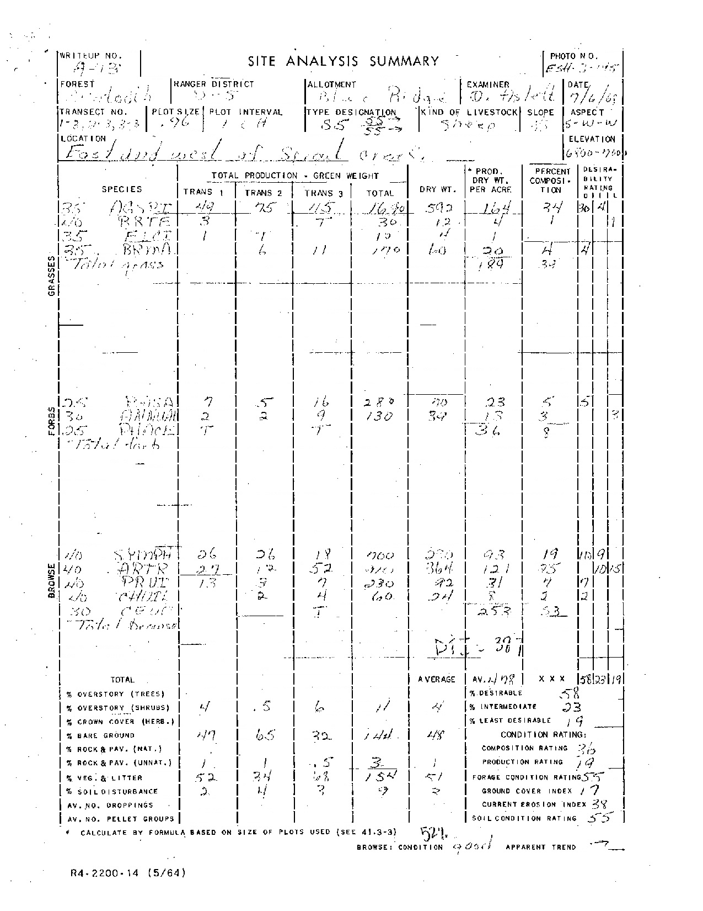
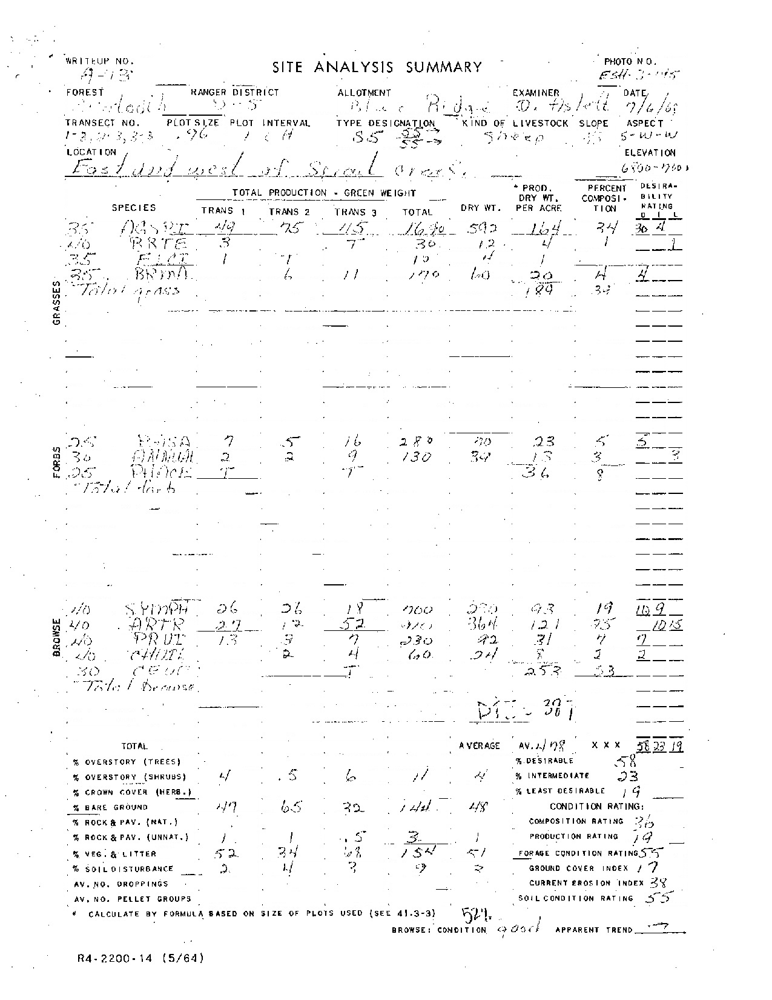

# Forest Service Image Recognition

This project consists in cleaning the Site Analysis Summaries images up in order
to perform text recognition on them. 

### Process

Steps 1 through 3 are achieved by running 'changeBackground.py'

1. This is the original pdf image: 

2. pdf to gray scale version: 

3. binary threshold version:

Steps 4 through 6 are achieved by running 'deleteVertical.py' and 'deleteHorizontal.py'

4. delete vertical lines from the binary version

5. delete horizontal lines from the binary version 

6. merge step 4 and step 5

